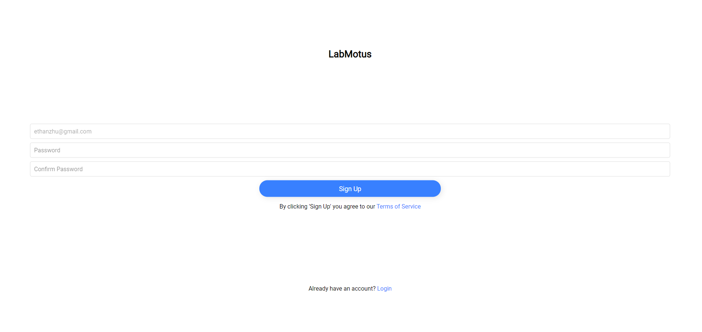
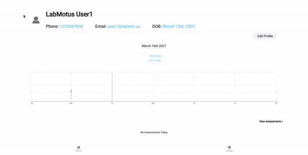

# LabMotus

## Description 

We are building a telehealth platform that lets clinicians provide remote care for patients via sharing video recordings of assessments and easily viewing recovery trends. We intend on later adding an automatic computation of accurate patient range-of-motion data through 3D video analysis.

Currently, we have a Patient Android app and a Clinician browser portal. The clinician can create patient accounts, and assign different assessments to their patients on different dates. The patient can record assessments assigned to them. Once the patient finishes recording, the video is uploaded to our cloud. The clinician can see a list of their patients as well as each patient’s symptom report logs and trends. Patients can see their own reports.

Currently, most physical assessments are completed solely by eye, which is prone to human error. Furthermore, the pandemic has limited patient and clinician access to in-person appointments, which means patients are more likely to fall behind on treatment. Our project will be a good tool for providing accurate patient assessment data, and for users to keep track of patient progress.

## Key Features

### Patient Complete Sign Up Webpage

- **Complete Sign Up**

  - The patient can complete the signup process upon receiving a confirmation email that their clinician has created an account for them.

    

### Patient App

*Note: The following views were taken from a desktop, but it should be an app view.*

- **Login**
  
  - Patient can login using their email and password
  
    

- **View Assessments**
  
  - Upon logging in, users see the symptom log page

    
    
    
    

  - They can click 'View Assessments' users can see further details

    

- **Settings**

  - Patients can change their email, phone number, password, view Terms of Services and logout in settings

    

### Clinician Portal

- **Login**

  - Clinician can login using their email and password

    

- **Sign Up**

  - Clinician can signup using their email

    

- **Patients**

  - Clinician can view and search for all their patient as well as edit their information

    
    
    
    

- **Assessments**

  - Clinician can add assessments for each patient

    

- **Settings**

  - Clinicians can change their email, password, view Terms of Services and logout in settings

    

## Instructions

The app is used by patients to record their assessments as instructed by their clinician. As such, when our solution is used by our target market, clinicians will be given an invite 

### Clinician Side

To access the clinician side, click “See clinician portal” on the [landing page](http://labmotus-clinician.s3-website-us-east-1.amazonaws.com/), then you will get to the login page. You can either login with a username and password, or you can click “Sign Up” at the bottom. There you will be asked to create an account with an email and password. You can then use the created email and password to log in.

**Add a Patient:** Click “Home” at the bottom, then click “Add Patient”. Enter the patient’s full name, email, and phone number in the corresponding text boxes. Enter the patient’s birthdate by clicking the date in between full name and email, then use the menu to select the desired date. Then click “Send confirmation email to patient”. This will send an email to the patient that will allow them to finish creating their account. (See patient side for what to do next) Click “Back” at the top to go back to home without submitting.

**Search/View Patient:** Click “Home” at the bottom. Type in the search bar to search for patients specified in the list below. Each bar in the list contains the patient’s name, then their phone number under that. Clicking on the bar takes you to the patient’s assessment page. (See patient app.) This page also contains patient name, email, phone number and date of birth. You can edit this information by clicking “Edit profile” on the top right. This will bring up a menu which you can edit to change patient info. Click the button at the bottom to enact those changes. Otherwise, click outside the small menu to exit without changing anything.

**Add Assessment:** Click “Home”, then click one of the patients. You will then see the patient’s assessment page (see patient app). Click “View Assessments” to go to the patient assessments. Click “Add Assessment” to open up a small menu. Select the desired exercise at the top, then click “Add Assessment”. Click “Cancel” to leave the menu. The assessments will appear in the scroll list once the page is reloaded.

**Edit Account Info:** Click “Settings” at the bottom. You can view your name, the clinic you belong to, and edit your email and password. When you click your email or password, a small menu will appear. Enter the desired information and click the button at the bottom to enact your desired changes. Otherwise, click outside the menu to exit without changing anything. You can also view the terms of service, when we write the actual ToS at a later date. 

**Log Out:** Click “Settings” at the bottom navigation bar. Click “Logout” at the bottom of the settings list to log out.

### Patient Side

**Download on Android:** To download the app on an Android device, go to the [landing page](http://labmotus-clinician.s3-website-us-east-1.amazonaws.com/) and click “Download patient app”, which will download a .apk file that will install the app if opened and downloaded on an Android device.

*Note: Some phone browsers may have problems directly downloading the .apk file. Chrome is one example that our team members used and experienced trouble downloading.* 

**Access the App:** To login, you will first need to receive a confirmation email from the clinician. Once you receive that email, click the link and enter your password. Once you complete that, go to the login page and enter your email and password.

**View Assessments:** The top text will display the displayed date. Below there is a graph that displays data over time, and a scrollbar below that contains various joints and their ranges of motion. Click “Select Date” to change to the date of your choice, and “Go to Today” to change the date to the current date. Click “View Assessments” for a text-based view of this data. You will get a list of submitted videos, and the data obtained from those videos. Click “Watch Video” to watch the video if it exists, or a blank page if the video does not exist.

The above information can also be obtained by clicking the Assessments button in the bottom navigation bar.

**Record a Video:** In “View Assessments”, the items coloured in red are assessments that have yet to be completed. Click “Record Video” to record a video. Hit the button when done. The feature that analyzes this video to give data like the data displayed there already will be implemented for deliverable 3. Currently, the returned results are generated at random.

**Edit Account Info:** Click “Settings” at the bottom. You can view your name, your birthdate, and edit your email, phone number, or password. When you click email, phone number or password, a small menu will appear. Enter the desired information and click the button at the bottom to enact your desired changes. Otherwise, click outside the menu to exit without changing anything. You can also view the terms of service, when we write the actual ToS at a later date. 

**Log Out:** Click “Settings” at the bottom navigation bar. Click “Logout” at the bottom of the settings list to log out.


 ## Development requirements
Start by downloading the latest LTS version of [npm](https://www.npmjs.com/get-npm) and [Node.js](https://nodejs.org/en/) for your operating system.

Clone the Github repo

```
git clone https://github.com/csc301-winter-2021/team-project-4-labmotus.git
```

For the Patient App and Clinician Portal, change `mock` to `false` in the respective config.json files. This will redirect the API calls to a local Mock API, not requiring the cloud to be run.

The root directory of the project is `labmotus-project`. 

If you want to use firebase functionality on cloud, you must create a firebase project. You must manually get the firebase service credentials, from the firebase dashboard and save the json credentials file to `labmotus-project/cloud/firebase-service-key.json`. You must also create an App on firebase and obtain the API credentials, one for patient app in `labmotus-project/patient-app/firebase.json` and one for the clinician portal in `labmotus-project/clinician-portal/firebase.json`.

The firebase password reset email is used for patient sign up. Instead of the default link, the link`<Server Address>/finalize-sign-up?raw&email=%EMAIL%&link=%LINK%`. Where `<Server Address>` is where the clinician portal is hosted, should be provided.

### Config

In each of the 3 `cloud`, `patient-app`, ` clinician-portal` folders, there is a `config.json` file that options can be modified in. `mock` will change whether the specific component should use a mock API instead of connecting to other components. Double check the ip configurations.

### Install Node Modules

```
cd labmotus-project/cloud
npm install
```

```
cd labmotus-project/common/types
npm install
```


```
cd labmotus-project/patient-app
npm install
```

```
cd labmotus-project/clinician-app
npm install
```

### Starting the Applications

To run the development servers:

In a separate terminal run

```
cd labmotus-project/cloud
npm start
```

To run the patient app, you do

```
cd labmotus-project/patient-app
npm start
```

For the clinician portal, in another terminal in the directory and do

```
cd labmotus-project/clinician-portal
npm start
```

 ## Deployment and Github Workflow

Our CI/CD pipeline is built through CircleCi. We initially wanted to use Github actions since it integrates easily with Github but found it to be limited due to the classroom constraints. We switched to CircleCi after some research since it’s free and integrates well with Github. It currently automatically deploys on commits in the main branch. Automatic deployment of the clinician portal is available at http://labmotus-clinician.s3-website-us-east-1.amazonaws.com/. Automatic deployment of the API is available at http://labmotus.us-east-1.elasticbeanstalk.com/. 

Our team used the trunk-based development model, so everybody would work on the `main` branch. We used this method as we decided pull requests weren’t completely necessary as we wouldn’t be working on the same files. This resisted merge conflicts in the case that someone worked in a branch for a long period without pulling from`main`. We made frequent commits to avoid merge conflicts as much as possible since the app was changing frequently. There were a few branches we did use occasionally such as `clinician-api`, `clinician-pages`, and `patient-components`. A full list of all our branches seen [here](https://github.com/csc301-winter-2021/team-project-4-labmotus/branches).

Branches also helped when we made changes to the code but weren’t entirely sure if it was working for everyone. For example, one of our team members found that they had a ‘React Hook Error’ every time they ran the code, despite running the same code as the others. To avoid pushing code that might break the whole app, they developed in a branch instead.

When branches were used, we also made pull requests to merge with the `main` branch. We could request someone to review the request but we made it optional. The idea was that whoever came upon a pull request would simply merge it to `main` to avoid merge conflicts as much as possible. We made sure that whatever we committed to `main` would build and ran lint to ensure the code was well-written. By using pull requests, we could easily link issues and close them upon merging the request. When pushing directly to `main`, we would manually close the issue.

Our team practiced short and concise commit messages as much as possible. This way, other members could know what tasks had been completed without having to review all the code differences. When large changes were made, we would also tell the others in our Discord server. 

This workflow helped ensure that only clean and running code would be deployed. It helped our team save time, conflict, and work well as a team.

 ## Licenses 

We will apply the Unlicense to our codebase, which gives generous (essentially unrestricted) permissions for using the code while protecting our team from liability for how the code is used. We chose this license because we want to impose as few restrictions as possible on our partner, and our team has no intent to profit from the code.

